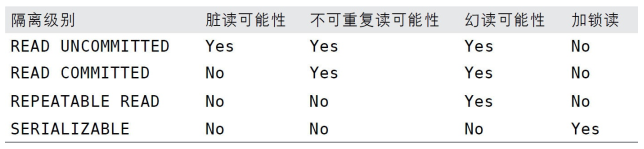

[toc]


### 事务
事务,就是一组原子性的sql查询,一个独立的工作单元

ACID

原子性
一致性,
隔离性
持久性


对于一些不需要事务的查询类应用，选择一个非事务型的存储引擎， 可以获得更高的性能。 即使存储引擎不支持事务， 
也可以通过LOCK TABLES语句为应用提供一定程度的保护， 这些选择用户都可以自主决定。


#### 死锁
死锁检测
超时检查

#### 事务日志
使用事务日志， 存储引擎在修
改表的数据时只需要修改其内存拷贝， 再把该修改行为记录到持久在硬
盘上的事务日志中， 而不用每次都将修改的数据本身持久到磁盘

事务日志持久以后， 内存中被修改的
数据在后台可以慢慢地刷回到磁盘。

修改数据需要写两次磁盘。

#### mysql中的事务

mysql的存储引擎有的支持事务,有的不支持

MySQL默认采用自动提交（ AUTOCOMMIT） 模式。 也就是说， 如果不
是显式地开始一个事务， 则每个查询都被当作一个事务执行提交操作。
在当前连接中， 可以通过设置AUTOCOMMIT变量来启用或者禁用自动提交
模式


MySQL服务器层不管理事务， 事务是由下层的存储引擎实现的。 
所以在同一个事务中，混合使用了事务型和非事务型的表,那么就使用了多种存储引擎,这样的事务是不保证可靠的
如果事务正常提交,那么不会有什么问题
但是如果事务失败了,由于非事务型的表使用的存储引擎不支持回滚,那么非事务型的表上的变更就无法撤销.
这会导致数据库处于不一致的状态
同时,在非事务型的表上执行事务相关操作的时候， MySQL通常不会发出提醒， 也不会报错
所以需要程序员自己注意.


### ACID中的I,隔离级别
当系统中有多个事务同时执行时,系统中就有对数据的同时读写,这时就产生了一致性的问题.
一致性与并发性是两个不可得兼的指标,隔离级别就是在一致性与并发性之间的折中.
>The isolation level specifies the kind of phenomena that can occur during the execution of concurrent SQL-transactions.

在并发事务执行中,会发生不同程度的不一致

+ 脏读(Dirty  Read):P1
SQL-transaction T1 modifies a row. 
SQL-transaction T2 then reads that row before T1 performs a COMMIT.
If T1 then performs a ROLLBACK, T2 will have read a row that was never committed and that may thus be considered to have never existed.
**事务T1读到了事务T2的未提交的修改**
+ 不可重复读(Non-repeatable read):P2
SQL-transaction T1 reads a row. 
SQL-transaction T2 then modifies or deletes that row and performs a COMMIT. 
If T1 then attempts to reread the row, it may receive the modified value or discover that the row has been deleted.
**事务T1读取某行数据.事务T2对这一行进行了操作(修改/删除)并提交.
事务T1再次读这行数据时,发现和上次读的不一样(值变了或行消失了)**
+ 幻读(Phantom read):P3
SQL-transaction T1 reads the set of rows N that satisfy some`search condition`. 
SQL-transaction T2 then executes SQL-statements that generate one or more rows that satisfy the `search condition` used by SQL-transaction T1. 
If SQL-transaction T1 then repeats the initial read with the same <search condition>, 
it obtains a different collection of rows.
**事务T1按照某个搜索条件读取了某些行
事务T2操作了符合T1搜索条件中的行
事务T1按照同样搜索条件操作时,发现结果不一样了**

以上定义来自[ANSI SQL-92 standard官方sql定义文档](https://www.contrib.andrew.cmu.edu/~shadow/sql/sql1992.txt)
http://web.cecs.pdx.edu/~len/sql1999.pdf

而按照萨师煊老师"数据库系统概论"的教材的说法
>仔细分析并发操作带来的数据不一致性主要包括丢失修改,不可重复读,读脏数据....不可重复读中的后两种有时也称为幻影现象.


可以看到,关于事务并发执行造成的不一致的各种现象,是有着不同的分类的,`不可重复读`这个名词在不同的分类标准中是有不同的涵义的.
现在我们以`ANSI-SQL-92`为标准,脏读的概念是很容易理解的,
而*不可重复读与幻读,则不是那么容易区分*,尤其是如果看一些用举例的方式来介绍这两种概念的博客,那更是难以区别.
因为从字面上来讲,`不可重复读`往往被理解定义为`同一事务中执行两次相同的sql操作,结果却不一样`
然而`ANSI-92`中的`幻读`和`不可重复读`都符合这个说法.
所以,**还是按照`ANSI-92SQL`标准的定义,
`幻读`与`不可重复读`的区别就是,不可重复读发生在某个行上,幻读发生在某个搜索条件上**
(网友的相关讨论:
https://stackoverflow.com/questions/11043712/what-is-the-difference-between-non-repeatable-read-and-phantom-read)

从脏读到不可重复读到幻读,不一致的程度越来越轻,并发的程度则越来越低.
根据3种情,ANSI-SQL92进一步定义了不同的隔离级别,解决了不同程度的不一致性.



每一种级别都规定了一个事务中所做的修改，哪些在事务内和事务间是可见的， 哪些是不可见的。 
较低级别的隔离通常可以执行更高的并发，系统的开销也更低。
```
read uncommitted
read committed
repeatable read
serializable
```
不同级别之间的差异就在于它们对不一致性的允许程度不同.
如果不保证任何的一致性,P1/P2/P3都有可能出现,那么就是`read uncommitted`的隔离级别
如果保证P1不会出现,P2/P3有可能出现,那么就是`read committed`的隔离级别
如果保证P1/P2不会出现,P3有肯能出现,那么就是`repeatable read`级别
如果保证P1/P2/P3都不会出现,那么就是`serilizable`级别
标准只是规定了级别,不会给出具体的实现.


Transaction isolation levels control the following:
事务隔离级别会影响这些事情

+ Whether locks are taken when data is read, and what type of locks are requested
+ How long the read locks are held.
+ Whether a read operation referencing rows modified by another transaction:
  - Block until the exclusive lock on the row is freed.
  - Retrieve the committed version of the row that existed at the time the statement or transaction started.
  - Read the uncommitted data modification.

Choosing a transaction isolation level doesn't affect the locks that are acquired to protect data modifications. 
事务隔离级别的不同选择并不会影响用于包含数据修改的锁需要用到的锁
A transaction always gets an exclusive lock on any data it modifies and holds that lock until the transaction completes, regardless of the isolation level set for that transaction. 
For read operations, transaction isolation levels primarily define the level of protection from the effects of modifications made by other transactions.


关于SQL事务隔离级别的其他参考文献:
A Critique of ANSI SQL Isolation Levels
https://www.microsoft.com/en-us/research/wp-content/uploads/2016/02/tr-95-51.pdf
对ANSI-SQL隔离级别的补充

A Summary of the Original Paper “A Critique of ANSI SQL Isolation Levels”with concrete SQL-DML Examples

https://wiki.hsr.ch/Datenbanken/files/Paper_ANSI_SQL_Isolation_Levels_Stefan_Luetolf_V2_1.pdf
### 并发控制,隔离级别的具体实现

#### 悲观并发控制,基于锁解决P1/P2/P3问题

#### 乐观并发控制

#### mysql的具体实现
**mysql对事务隔离级别的具体实现相较于ANSI-SQL92的官方标准更加严格
mysql的可重复读隔离级别能够解决一定程度的幻读问题**

mysql的事务隔离级别是怎样实现的?怎样解决P1/P2/P3问题的
最权威的答案当然来自与官方参考文档,什么*高性能mysql/mysql技术内幕/技术博客*都只能算辅助材料.

https://dev.mysql.com/doc/refman/8.0/en/innodb-transaction-isolation-levels.html


由于`read uncommitted`这个级别问题太多,而`SERIALIZABLE`这个级别并发度太低
所以这两个级别在实践环境中都很少用到.

##### mysql怎么实现`READ COMMITTED`级别,
在这个级别,保证不会出现脏读问题,可能出现不可重复读,幻读

>Each consistent read, even within the same transaction, sets and reads its own fresh snapshot.

在自己的snapshot上读,自然就读不到其他事务未提交的数据


##### mysql怎么实现`repeatable read`级别
>This is the default isolation level for InnoDB

`repeatable read`是InnoDb引擎的默认隔离级别

>Consistent reads within the same transaction read the snapshot established by the first read. 
This means that if you issue several plain (nonlocking) SELECT statements within the same transaction, 
these SELECT statements are consistent also with respect to each other.

还是通过在快照上读,解决脏读的问题

>For locking reads (SELECT with FOR UPDATE or FOR SHARE), UPDATE, and DELETE statements, 
locking depends on **whether the statement uses a unique index with a unique search condition, or a range-type search condition.
对于`select for update/share,update/delete`这些操作,要根据
是使用了唯一索引的唯一搜索条件,还是使用范围查询条件来采取不同策略**
For a unique index with a unique search condition, InnoDB locks only the index record found, not the gap before it.
**如果是在唯一索引上使用了唯一搜索条件,那么就使用记录锁,可以解决在~条件下的不可重复读的问题**
For other search conditions, InnoDB locks the index range scanned, using gap locks or next-key locks to block insertions by other sessions into the gaps covered by the range.
**如果是其他的搜索条件,那么根据条件使用gap lock(间隙锁)或next-key lock(临键锁)**

通过next-key解决幻读问题,解决了幻读自然也就解决了不可重复读
https://dev.mysql.com/doc/refman/8.0/en/innodb-next-key-locking.html
>To prevent phantoms, InnoDB uses an algorithm called next-key locking that combines index-row locking with gap locking. 
**InnodDb使用next-key算法解决幻读的问题,这个算法分为两部分:锁记录,锁gap**
InnoDB performs row-level locking in such a way that when it searches or scans a table index, 
it sets shared or exclusive locks on the index records it encounters. 
**搜索或扫描索引时,在记录加排他锁或共享锁**
Thus, the row-level locks are actually index-record locks. 
In addition, a next-key lock on an index record also affects the “gap” before that index record. 
**此外,也根据where条件在gap上加锁**
That is, a next-key lock is an index-record lock plus a gap lock on the gap preceding the index record. 
If one session has a shared or exclusive lock on record R in an index, another session cannot insert a new index record in the gap immediately before R in the index order. 


什么时候用间隙锁,什么时候用临键锁呢?
这个问题不该这么问,是临键锁要把事情分为锁记录和锁gap两部分
一个gap可以被多个事务加锁.


当然,好像gap-lock也有自己单独使用,即不需要锁记录的场景.
https://docs.oracle.com/cd/E17952_01/mysql-5.1-en/innodb-record-level-locks.html

>在read committed的级别中,
Gap locking is only used for foreign-key constraint checking and duplicate-key checking.

https://ningyu1.github.io/site/post/50-mysql-gap-lock/


#### 通过实例验证mysql的事务隔离级别实现

验证一下,不用索引的话会加表锁,用了索引会用行锁?

https://ningyu1.github.io/site/post/50-mysql-gap-lock/
https://blog.pythian.com/understanding-mysql-isolation-levels-repeatable-read/
https://www.cnblogs.com/zhoujinyi/p/3435982.html
http://hedengcheng.com/?p=771

MySQL可以通过执行SET TRANSACTION ISOLATION LEVEL命令来设
置隔离级别。 新的隔离级别会在下一个事务开始的时候生效。 可以在配
置文件中设置整个数据库的隔离级别， 也可以只改变当前会话的隔离级
别


解决并发读写安全性的一个方法:使用读写锁
提供共享资源并发程度的方法:调整锁的粒度,表锁,行级锁
当然,锁粒度小了,上锁的开销就大了
#### mysql中(InnoDB引擎)的各种锁
https://dev.mysql.com/doc/refman/8.0/en/innodb-locking.html
https://github.com/octachrome/innodb-locks
https://www.slideshare.net/billkarwin/innodb-locking-explained-with-stick-figures

读写锁,
行级锁,读事务在行上加共享锁,写事务在行上加互斥锁

意向锁

记录锁
>A record lock is a lock on an index record.
记录锁在`index record`上加锁,可是这个`index record`究竟是什么呢?
an entry in the primary index or in a secondary index.

就是说,如果用到的是主键索引,那么就是在row data上加锁
如果用到的是非主键索引(也就是二级索引/辅助索引),那么就是在二级索引的entry上加锁,而二级索引的entry是什么呢?是主键啊
所以用了无论是在聚集索引上,还是在二级索引上,用了记录锁,
都相当于锁住了行记录,row data无法修改.
**即虽然lock on index record,但是最终能够lock on row data record**


间隙锁
>A gap lock is a lock on a gap between index records, or a lock on the gap before the first or after the last index record.

间隙锁,就是在gap上加锁
锁定一个范围，但不包括记录本身,:`()`
防止同一事务的两次当前读，出现幻读的情况

两个事务可以在重叠的gap上加间隙锁,间隙锁的作用就是不能在指定的gap上添加记录


临键锁
>A next-key lock is a combination of a record lock on the index record and a gap lock on the gap before the index record.

临键锁,就是记录锁+间隙锁,:`(],[)`
锁定一个范围，并且锁定记录本身


加锁策略?!

如果一条SQL语句用不到索引是不会使用行级锁的，会使用表级锁把整张表锁住

InnoDB这种行锁实现特点意味着：只有通过索引条件检索数据，InnoDB才使用行级锁，否则，InnoDB将使用表锁?

行级锁都是基于索引的，如果一条SQL语句用不到索引是不会使用行级锁的，会使用表级锁。

所以
>As InnoDB executes each UPDATE, it first acquires an exclusive lock for each row, and then determines whether to modify it.
???

#### (mysql的InnoDb引擎)加锁规则,什么样的语句会用什么样的锁?
https://dev.mysql.com/doc/refman/8.0/en/innodb-locks-set.html
https://stackoverflow.com/questions/40871900/does-locking-a-row-in-mysql-innodb-always-lock-all-associated-index-records-as-w
https://stackoverflow.com/questions/49197964/update-where-multiple-rows-locking-in-innodb

#### mvcc多版本并发控制
mvcc相较于锁,进一步提高并发性.

可以认为MVCC是行级锁的一个变种， 但是它在很多情况下避免了加锁操作， 因此开销更低。
虽然实现机制有所不同， 但大都实现了非阻塞的读操作， 写操作也只锁定必要的行。

mvcc没有一个统一的实现标准,典型的有乐观并发控制和悲观并发控制.
mvcc的基本原理是保存数据在某个时间点的快照.


悲观并发控制:“先取锁再访问”的保守策略
在效率方面，处理加锁的机制会让数据库产生额外的开销，还有增加产生死锁的机会；另外，在只读型事务处理中由于不会产生冲突，也没必要使用锁，这样做只能增加系统负载；还有会降低了并行性，一个事务如果锁定了某行数据，其他事务就必须等待该事务处理完才可以处理那行数

乐观并发控制:假设多用户并发的事务在处理时不会彼此互相影响
各事务能够在不产生锁的情况下处理各自影响的那部分数据。在提交数据更新之前，每个事务会先检查在该事务读取数据后，有没有其他事务又修改了该数据。如果其他事务有更新的话，正在提交的事务会进行回滚

mvcc怎样实现隔离级别


事务的实际应用
高并发余额扣减
https://www.zhihu.com/question/61484424/answer/815781396